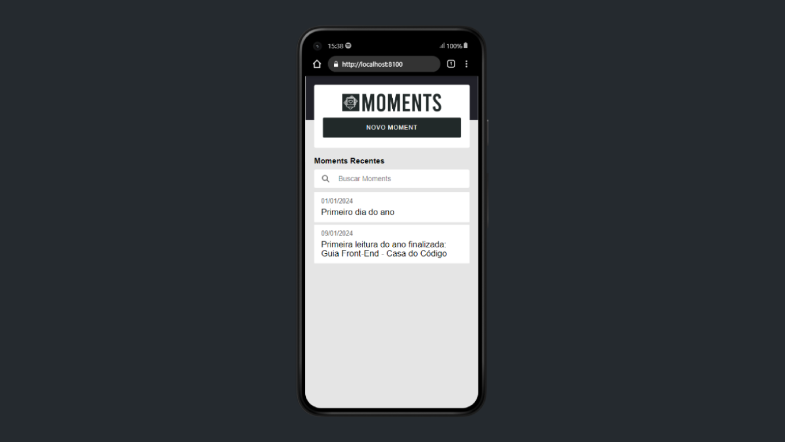

# Ionic - Moments

Este projeto foi desenvolvido para fins de estudo sobre Angular utilizando o framework Ionic para desenvolvimento mobile.

## Introdução

O projeto se trata de um aplicativo para registro de momentos.

### Pré-requisitos

Ao clonar o repositório, é necessário primeiramente baixar as dependências do projeto. Abra um novo terminal no diretório do projeto e digite comando:

```
npm install
```

Também será necessário utilizar uma API que está disponível no link abaixo.

Link do repositório da API: https://github.com/by-scottlucas/nest-moments-api.git

Após atender os pré-requisitos já é possível executar o projeto em modo de desenvolvimento, basta digitar o seguinte comando no terminal:

```
ionic serve
```

## Tecnologias utilizadas:

* TypeScript
* Angular
* Ionic

## Imagem do Projeto

